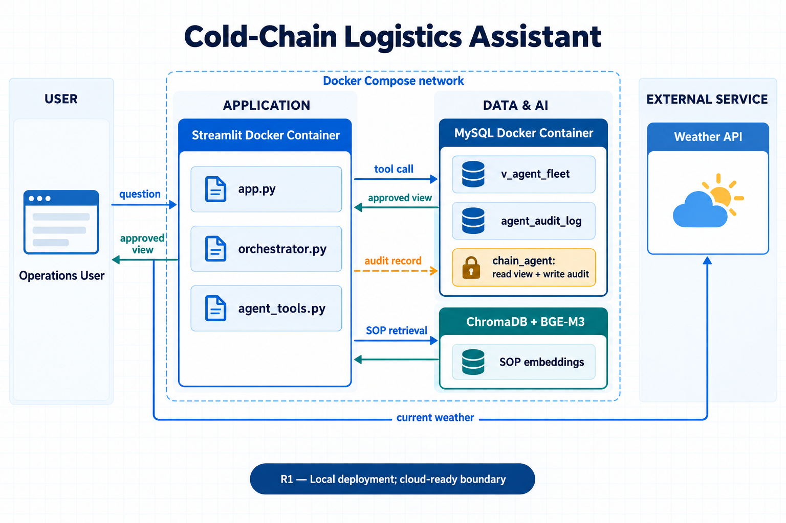
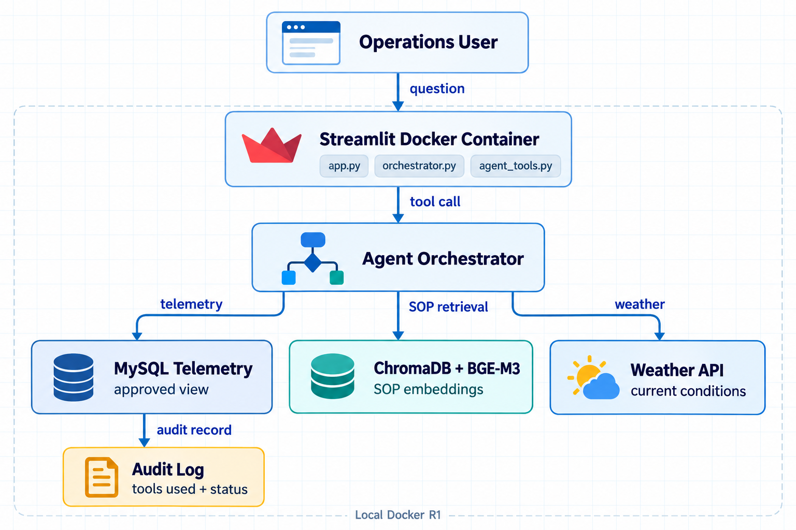

# Cold-Chain Logistics Assistant

Local Docker application for querying cold-chain telemetry, searching SOP
guidance, and checking corridor weather.

## Architecture

```text
Browser → Streamlit container → orchestrator → tools
                                      ├── MySQL container
                                      ├── local ChromaDB + BGE-M3
                                      └── Open-Meteo weather API
```

The user asks a cold-chain logistics question through the Streamlit interface.
The orchestrator decides whether the request needs fleet data from MySQL, SOP
guidance from ChromaDB, or weather information from the weather API. It then
combines the relevant results into a response and records the request in the
audit log, while database permissions ensure that the agent can access only the
data it needs.

The agent uses the restricted `chain_agent` database user. It can read only
the `v_agent_fleet` view and write audit records to `agent_audit_log`. The
ingestion process uses the separate `chain_ingest` user.

## System design

Detailed architecture:



Application flow:



## Prerequisites

- Docker Desktop
- Python 3.12
- A configured `.env` file (never commit it)
- The BGE-M3 model available through the Hugging Face cache for the first SOP
  indexing run

Install the application dependencies into the active environment with:

```bash
python -m pip install -r requirements-docker.txt
```

The local application uses the existing `data/source/data.txt`, policy file,
and local ChromaDB directory. No Oracle account, EC2 instance, or cloud
deployment is required.

The ChromaDB files are generated runtime data and are intentionally ignored by
Git. A fresh checkout recreates them when the bootstrap script indexes the SOP.

## Start the application

Activate the project environment first:

```bash
source .venv312/bin/activate
```

For a complete local rebuild, run:

```bash
bash scripts/bootstrap_local.sh
```

The script starts MySQL, creates the local users and permissions, reloads the
telemetry table, refreshes the restricted view, indexes the SOP, and starts
Streamlit.

Open the application at:

```text
http://localhost:8502
```

For normal daily use, the containers can be started with:

```bash
docker compose up -d mysql streamlit
```

Check their readiness with:

```bash
docker compose ps
docker compose logs -f streamlit
```

## Verify the tools

In the Streamlit page, test:

```text
Show me three fleet telemetry records.
What should we do if the IoT temperature exceeds 4°C?
What is the current weather near latitude 34.0522 and longitude -118.2437?
```

Audit records can be checked with:

```bash
docker compose exec mysql mysql -uroot -p cold_chain
```

```sql
SELECT audit_id, tools_used, status, created_at
FROM agent_audit_log
ORDER BY audit_id DESC
LIMIT 10;
```

## Run automated tests

The tests exercise the telemetry security boundary, database result formatting,
SOP retrieval formatting, weather formatting, and the out-of-scope policy.

```bash
HF_HUB_OFFLINE=1 python -m unittest discover -s tests -v
```

## Stop the local services

```bash
docker compose stop
```

`docker compose stop` preserves MySQL and model data. Do not remove the named
volumes unless you intentionally want to delete the local database and model
cache.
